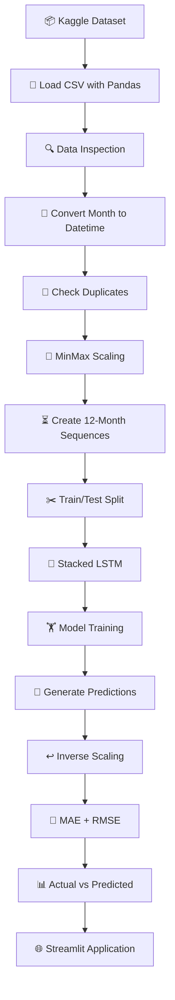
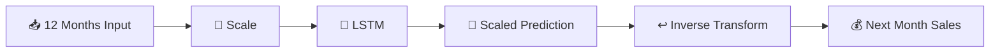

# 📈 Retail & Service Industries — Deep Learning Forecasting

<p align="center">

**An LSTM-based Deep Learning model for forecasting retail and service industry sales**

<br>

<a href="https://www.python.org/">

</a>
<a href="https://www.tensorflow.org/">

</a>
<a href="https://keras.io/">

</a>
<a href="https://pandas.pydata.org/">

</a>
<a href="https://scikit-learn.org/">

</a>
<a href="https://streamlit.io/">

</a>

</p>

---

## 🚀 Overview

This project implements a **Long Short-Term Memory (LSTM)** neural network for **time-series forecasting of retail and service industry sales**.

The model learns temporal patterns from historical monthly observations and uses the **previous 12 months of sales data** to forecast the following month's value.

The project covers the complete machine-learning pipeline:

**Dataset → Preprocessing → Scaling → Sequence Generation → LSTM → Training → Evaluation → Prediction → Streamlit Application**

The current forecasting target is:

> 🛒 **Supermarket and Grocery Stores**

The trained model and preprocessing objects are saved for reuse in a Streamlit prediction application.

---

## 🎯 Project Objective

The primary objective is to build a Deep Learning forecasting system capable of learning historical sales patterns and predicting future sales.

### Key Goals

* 📊 Analyze historical retail and service industry data
* 🧹 Prepare and preprocess time-series data
* 📏 Normalize numerical values using MinMaxScaler
* 🧠 Build an LSTM-based neural network
* ⏳ Learn temporal dependencies using a 12-month lookback window
* 📈 Forecast the next month's sales
* 📐 Evaluate predictions using MAE and RMSE
* 🌐 Provide an interactive Streamlit interface

---

# 🧠 Model Architecture

The project uses a **stacked LSTM architecture** implemented with Keras.

```text
                    HISTORICAL DATA
                          │
                          ▼
                 ┌──────────────────┐
                 │  12-Month Window │
                 └────────┬─────────┘
                          │
                          ▼
                 ┌──────────────────┐
                 │   LSTM - 50      │
                 │ return_sequences │
                 │      = True      │
                 └────────┬─────────┘
                          │
                          ▼
                 ┌──────────────────┐
                 │   Dropout 20%    │
                 └────────┬─────────┘
                          │
                          ▼
                 ┌──────────────────┐
                 │   LSTM - 50      │
                 │ return_sequences │
                 │      = False     │
                 └────────┬─────────┘
                          │
                          ▼
                 ┌──────────────────┐
                 │   Dropout 20%    │
                 └────────┬─────────┘
                          │
                          ▼
                 ┌──────────────────┐
                 │ Dense Output = 1 │
                 └────────┬─────────┘
                          │
                          ▼
                🔮 NEXT MONTH FORECAST
```

### Architecture Summary

| Layer      | Configuration           |
| ---------- | ----------------------- |
| Input      | 12 monthly observations |
| LSTM 1     | 50 units                |
| Dropout    | 20%                     |
| LSTM 2     | 50 units                |
| Dropout    | 20%                     |
| Dense      | 1 output                |
| Optimizer  | Adam                    |
| Loss       | Mean Squared Error      |
| Epochs     | 50                      |
| Batch Size | 32                      |

The implemented architecture contains **30,651 trainable parameters**.

---

# 🔄 End-to-End Pipeline



---

# 📊 Dataset

The dataset used in this project is the **Retail and Service Industries Dataset** downloaded through KaggleHub.

```text
Dataset
   │
   ├── 441 monthly records
   │
   ├── 21 columns
   │
   ├── 1 date column
   │
   └── 20 numerical industry series
```

The notebook loads:

```text
australian_capital_retail.csv
```

The dataset contains **441 observations and 21 columns**, consisting of the monthly date plus 20 numerical retail/service industry series.

### Industry Categories

The dataset includes categories such as:

* ☕ Cafes, restaurants and catering services
* 🍽️ Cafes, restaurants and takeaway food services
* 👕 Clothing retailing
* 👟 Clothing, footwear and personal accessory retailing
* 🏬 Department stores
* 💻 Electrical and electronic goods retailing
* 🥦 Food retailing
* 👞 Footwear and other personal accessory retailing
* 🛋️ Furniture, floor coverings, houseware and textile goods retailing
* 🔨 Hardware, building and garden supplies retailing
* 🏠 Household goods retailing
* 📰 Newspaper and book retailing
* 🎮 Other recreational goods retailing
* 🛍️ Other retailing
* 💊 Pharmaceutical, cosmetic and toiletry goods retailing
* 🛒 Supermarket and grocery stores
* 🍔 Takeaway food services

---

# 📅 Time-Series Processing

The `month` column is converted into a datetime format and used as the DataFrame index.

```python
df['month'] = pd.to_datetime(
    df['month'],
    format='%d-%m-%Y'
)

df = df.set_index('month')
df = df.sort_index()
```

No duplicate rows were found during preprocessing.

---

# 📏 Data Normalization

The numerical data is normalized using **MinMaxScaler**.

```python
from sklearn.preprocessing import MinMaxScaler

scaler = MinMaxScaler()

df_scaled = pd.DataFrame(
    scaler.fit_transform(df[numerical_cols]),
    columns=numerical_cols,
    index=df.index
)
```

This transforms the numerical values into a normalized range suitable for neural-network training.

---

# ⏳ Sequence Generation

The model uses a **12-month lookback window**.

```text
Month 1 ──┐
Month 2   │
Month 3   │
...       ├──► LSTM ──► Month 13 Prediction
Month 12 ─┘
```

In other words:

```text
Past 12 Months
      │
      ▼
┌─────────────────────────┐
│ M1 M2 M3 ... M10 M11 M12│
└────────────┬────────────┘
             │
             ▼
          🧠 LSTM
             │
             ▼
        Next Month
```

The sequence-generation process produces:

```text
X shape = (429, 12, 1)
y shape = (429, 1)
```

---

# ✂️ Train / Test Split

The generated sequences are divided chronologically:

```text
429 sequences
      │
      ├─────────────── 80% ───────────────► Training
      │                                      343 samples
      │
      └─────────────── 20% ───────────────► Testing
                                             86 samples
```

The implementation uses the first 80% for training and the remaining 20% for testing.

---

# 🧠 LSTM Implementation

The model is implemented using **TensorFlow/Keras**:

```python
from tensorflow.keras.models import Sequential
from tensorflow.keras.layers import LSTM, Dense, Dropout

model = Sequential([
    LSTM(
        units=50,
        return_sequences=True,
        input_shape=(X_train.shape[1], 1)
    ),

    Dropout(0.2),

    LSTM(
        units=50,
        return_sequences=False
    ),

    Dropout(0.2),

    Dense(units=1)
])

model.compile(
    optimizer='adam',
    loss='mean_squared_error'
)
```

The resulting model has:

```text
Total Parameters:       30,651
Trainable Parameters:   30,651
Non-trainable:               0
```

---

# 🏋️ Training

The model is trained for **50 epochs** with a batch size of **32**.

```python
history = model.fit(
    X_train,
    y_train,
    epochs=50,
    batch_size=32,
    validation_data=(X_test, y_test),
    verbose=1
)
```

The training process records both training and validation loss, allowing the learning behavior of the network to be visualized.

---

# 📈 Training Performance

The notebook tracks:

* 📉 Training Loss
* 📉 Validation Loss
* 📊 Actual vs Predicted Sales

The training uses **Mean Squared Error (MSE)** as the optimization objective.

The loss curve can be visualized using:

```python
plt.plot(history.history['loss'])
plt.plot(history.history['val_loss'])
```

---

# 🔮 Prediction Pipeline



The prediction is first generated in the normalized scale and then transformed back into the original data scale using the saved scaler.

---

# 📐 Evaluation

The model evaluates its forecasting performance using:

### RMSE

**Root Mean Squared Error**

```text
RMSE = √ Mean((Actual - Predicted)²)
```

### MAE

**Mean Absolute Error**

```text
MAE = Mean(|Actual - Predicted|)
```

Implemented using:

```python
from sklearn.metrics import (
    mean_squared_error,
    mean_absolute_error
)

rmse = np.sqrt(
    mean_squared_error(
        actual_values,
        test_predictions
    )
)

mae = mean_absolute_error(
    actual_values,
    test_predictions
)
```

The notebook also generates an **Actual vs Predicted** visualization for the test set.

---

# 🎯 Current Forecasting Target

The current model is configured to forecast:

```python
target_column = 'supermarket_and_grocery_stores'
```

Therefore, the current implementation is specifically focused on predicting the next month's value for **Supermarket and Grocery Stores**.

---

# 💾 Saved Model

The trained model is exported as:

```text
lstm_retail_sales_model.keras
```

The preprocessing scaler is saved as:

```text
minmax_scaler.pkl
```

The numerical column ordering is saved as:

```text
numerical_columns.pkl
```

## This makes it possible to reload the trained system without retraining from scratch.

# 🌐 Streamlit Application

The project also includes a **Streamlit interface** for making predictions.

```text
                ┌──────────────────────┐
                │     Streamlit UI     │
                └──────────┬───────────┘
                           │
                    Enter 12 Months
                           │
                           ▼
                ┌──────────────────────┐
                │   Input Processing   │
                └──────────┬───────────┘
                           │
                           ▼
                ┌──────────────────────┐
                │   MinMax Scaler      │
                └──────────┬───────────┘
                           │
                           ▼
                ┌──────────────────────┐
                │   LSTM Model         │
                └──────────┬───────────┘
                           │
                           ▼
                ┌──────────────────────┐
                │  Inverse Transform   │
                └──────────┬───────────┘
                           │
                           ▼
                ┌──────────────────────┐
                │ 💰 Forecast Result   │
                └──────────────────────┘
```

The Streamlit application loads the `.keras` model and the saved scaler to generate forecasts.

---

# 🛠️ Tech Stack

| Technology      | Purpose                      |
| --------------- | ---------------------------- |
| 🐍 Python       | Core programming language    |
| 🧠 TensorFlow   | Deep Learning framework      |
| 🔥 Keras        | LSTM model development       |
| 🐼 Pandas       | Data manipulation            |
| 🔢 NumPy        | Numerical computation        |
| 📊 Matplotlib   | Visualization                |
| 🤖 Scikit-learn | Scaling & evaluation         |
| 💾 Joblib       | Saving preprocessing objects |
| 🌐 Streamlit    | Interactive prediction UI    |
| 📓 Google Colab | Development environment      |

---

# 📁 Project Structure

```text
Retail-and-Service-Industries/
│
├── 📓 Retail_and_Service_Industries.ipynb
│
├── 🧠 lstm_retail_sales_model.keras
│
├── 📏 minmax_scaler.pkl
│
├── 📋 numerical_columns.pkl
│
├── 🌐 streamlit_app.py
│
├── 📊 australian_capital_retail.csv
│
└── 📖 README.md
```

---

# ⚙️ Installation

Clone the repository:

```bash
git clone https://github.com/your-username/Retail-and-Service-Industries.git
cd Retail-and-Service-Industries
```

Install dependencies:

```bash
pip install tensorflow pandas numpy scikit-learn matplotlib joblib streamlit kagglehub
```

---

# ▶️ Run the Notebook

Open:

```text
Retail_and_Service_Industries.ipynb
```

Recommended environment:

**Google Colab / Jupyter Notebook**

Run the notebook sequentially to:

1. 📦 Download the dataset
2. 📊 Load the data
3. 🧹 Preprocess the dataset
4. 📏 Scale the numerical features
5. ⏳ Generate time-series sequences
6. ✂️ Split training/testing data
7. 🧠 Build the LSTM
8. 🏋️ Train the model
9. 🔮 Generate predictions
10. 📐 Evaluate performance
11. 💾 Save the trained model
12. 🌐 Launch the Streamlit application

---

# 🌐 Run Streamlit App

After the trained model and preprocessing files are available:

```bash
streamlit run streamlit_app.py
```

The application accepts the required historical input and uses the trained LSTM model to forecast the next month's sales.

---

# 📊 Model Workflow at a Glance

```text
                    ┌─────────────────┐
                    │   Retail Data   │
                    └────────┬────────┘
                             │
                             ▼
                    ┌─────────────────┐
                    │   Preprocessing │
                    └────────┬────────┘
                             │
                             ▼
                    ┌─────────────────┐
                    │  MinMaxScaler   │
                    └────────┬────────┘
                             │
                             ▼
                    ┌─────────────────┐
                    │ 12-Month Window │
                    └────────┬────────┘
                             │
                             ▼
                    ┌─────────────────┐
                    │   LSTM Layer 1  │
                    │    50 Units     │
                    └────────┬────────┘
                             │
                             ▼
                    ┌─────────────────┐
                    │    Dropout      │
                    │      20%        │
                    └────────┬────────┘
                             │
                             ▼
                    ┌─────────────────┐
                    │   LSTM Layer 2  │
                    │    50 Units     │
                    └────────┬────────┘
                             │
                             ▼
                    ┌─────────────────┐
                    │    Dropout      │
                    │      20%        │
                    └────────┬────────┘
                             │
                             ▼
                    ┌─────────────────┐
                    │  Dense Output   │
                    │     1 Unit      │
                    └────────┬────────┘
                             │
                             ▼
                    ┌─────────────────┐
                    │  Next Month     │
                    │    Forecast     │
                    └─────────────────┘
```

---

# 💡 Why LSTM?

Traditional machine-learning models can struggle to represent sequential dependencies directly.

LSTM networks are designed for sequential data and can learn relationships between observations across time.

For this project:

```text
Historical Sales
       ↓
Temporal Patterns
       ↓
LSTM Memory
       ↓
Learned Representation
       ↓
Future Forecast
```

This makes LSTM a natural Deep Learning architecture for the project's monthly time-series forecasting task.

---

# 🚀 Future Improvements

Potential upgrades for future versions include:

* 🔥 Bidirectional LSTM
* 🧠 GRU comparison
* 📊 Multi-feature forecasting
* 🔮 Multi-step forecasting
* ⚡ Hyperparameter optimization
* 📉 Early stopping
* 🧪 Cross-validation for time series
* 📈 Additional forecasting metrics
* 📊 Interactive forecasting dashboards
* ☁️ Cloud deployment
* 🔄 Automated model retraining
* 🎯 Forecasting multiple industry categories simultaneously

---

# ⚠️ Limitations

This project is a forecasting experiment based on historical time-series data.

The current implementation:

* Forecasts one target series: `supermarket_and_grocery_stores`
* Uses a 12-month lookback window
* Uses a relatively small dataset of 441 monthly observations
* Uses a univariate sequence for the current LSTM input
* Does not incorporate external variables such as inflation, population, weather, holidays, or economic indicators

Therefore, predictions should be interpreted as **model-based forecasts rather than guaranteed future outcomes**.

---

# 🧪 Experiment Configuration

```text
┌───────────────────────────────┐
│        EXPERIMENT SETUP        │
├───────────────────────────────┤
│ Dataset Size       : 441 rows  │
│ Features           : 20        │
│ Lookback Window    : 12 months │
│ Training Samples   : 343       │
│ Testing Samples    : 86        │
│ LSTM Units         : 50 + 50   │
│ Dropout            : 0.20      │
│ Epochs             : 50        │
│ Batch Size         : 32        │
│ Optimizer          : Adam      │
│ Loss               : MSE       │
│ Output             : 1 value   │
└───────────────────────────────┘
```

---

# 🤝 Contributing

Contributions are welcome.

If you want to improve the project:

```text
Fork
  ↓
Create Branch
  ↓
Make Changes
  ↓
Test
  ↓
Commit
  ↓
Pull Request
```

Ideas, model improvements, bug fixes, and better visualizations are welcome.

---

# 📜 License

This project is intended for educational and research purposes.

Add an appropriate open-source license to the repository if you plan to distribute or reuse the project publicly.

---

# 👨‍💻 Author

**Aravind**

Built as a Deep Learning and Time-Series Forecasting project using Python, TensorFlow/Keras and Streamlit.

---

<p align="center">

### 🧠 Learn from the past. Model the present. Forecast the future.

**Deep Learning • Time Series • LSTM • Keras • TensorFlow • Forecasting**

</p>
